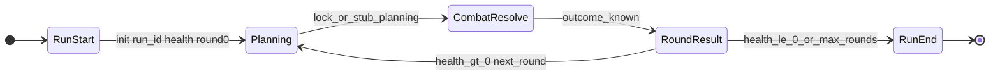

# Phase B — Detailed plan: run shell & round lifecycle

This document expands [§2 Phase B](../game-implementation-plan.md) in `game-implementation-plan.md`. It names **Godot scenes/scripts** to add or touch, maps **Phase A** dependencies, and calls out **Phase A gaps** Phase B must implement or stub.

---

## 1. Goal (parent doc)

Implement **“survive N rounds; player health persists; win/lose round”** **without** full combat simulation, **without** ghosts, **without** grid planning UI.

Deliverable: a **testable run loop** you can drive from the editor or minimal HUD: start run → advance **Planning → CombatResolve → RoundResult** → next round or **game over** when player run health ≤ 0.

---

## 2. State machine (authoritative behavior)

| Phase | Phase B responsibility | Combat / planning depth |
|-------|------------------------|-------------------------|
| **Planning** | Stub or “empty lock”: no real grid yet (Phase C). Optionally build a **minimal** `PlanningSnapshot` for logging. | **Stub OK** |
| **CombatResolve** | **No autobattle.** Return a **placeholder outcome** (e.g. always player win, or coin flip behind a debug flag, or `RunParams` test fixture) until Phase D. | **Stub required** |
| **RoundResult** | Apply **round win** (no damage) vs **round loss** (damage to **player run health** via placeholder formula). | **Real logic** (health + round index) |

Round win/lose definition (parent): **Win** = no damage to player run health this round; **Lose** = apply damage from formula **`f(surviving_enemy_value)`** until balance exists — implement as **`RunParams`**-driven callable (e.g. constant `5` or `enemy_count * 2`).

---

## 3. New scripts (recommended layout)

All paths under `res://Scripts/` unless noted. Prefer **`class_name`** + a single **Node** driver the scene instantiates.

| Script | Base | Role |
|--------|------|------|
| **`Run/RunParams.gd`** | `Resource` | `class_name RunParams`: `starting_player_health`, `max_rounds` (optional cap), `damage_on_loss_flat` or simple coefficients, flags for debug combat stub (`always_win`, etc.). Evolves from or sits beside [`GameParams`](../../Scripts/GameParams.gd) — **do not overload** `GameParams` with run fields if that confuses the legacy TCG scene; either subclass or parallel resource. |
| **`Run/RunState.gd`** | `RefCounted` | `class_name RunState`: `run_id: String`, `current_round_index: int`, `player_run_health: int`, optional streak counters, `is_terminal: bool`, reference to `RunParams`. Emits or exposes no signals itself if owned by controller (controller owns signals). |
| **`Run/RoundPhase.gd`** | — | `enum RoundPhase { PLANNING, COMBAT_RESOLVE, ROUND_RESULT }` (or nested inside `RunController`). |
| **`Run/RunController.gd`** | `Node` | **State machine owner:** holds `RunState`, `RunParams`, one `InstanceIdScope` per run (from Phase A), transitions phases, applies round damage, increments round, sets terminal. **Signals:** `phase_changed(RoundPhase)`, `run_health_changed(int)`, `run_ended(bool player_won_or_survived)`, `round_advanced(int)`. |
| **`Run/CombatOutcome.gd`** | `RefCounted` or small `Resource` | Result of stub combat: `player_won_round: bool`, optional `enemy_survivor_count: int` for damage formula. Produced by a **`stub_resolve_combat()`** method on `RunController` or dedicated helper. |
| **`Run/RunRoundDamage.gd`** | `RefCounted` (optional) | Pure function: `(RunParams, CombatOutcome) -> int` damage to player on loss. Keeps `RunController` thin. |

**Existing scripts to avoid extending for run logic (per parent §3):**

- [`GameState`](../../Scripts/GameState.gd) — legacy TCG turn/stack; **do not** bolt run phases onto it. Run mode should **not** call `GameState.create` / `run()` unless you explicitly want two modes in one scene (not recommended for Phase B clarity).

**Optional bridges (later):**

- Thin adapter that builds a **`PlanningSnapshot`** from run + deck when Phase C exists — not required for Phase B if combat is fully stubbed.

---

## 4. New / updated Godot scenes

| Scene | Purpose |
|-------|---------|
| **`Scenes/Run/run_shell.tscn`** (new) | Root for run mode: instance child **`RunController`**, instance or child canvas **`RunHud`**, optional **`RunDebugPanel`**. Can be `Control` full-screen or `Node2D` if you reuse board art later. |
| **`Scenes/Run/run_hud.tscn`** (new, optional split) | Labels: **run health**, **round #**, **phase name**. ProgressBar optional. Sub-scene keeps `run_shell.tscn` small. |
| **`Scenes/Run/run_debug_panel.tscn`** (new, optional) | Buttons: **End planning**, **Resolve combat (stub)**, **Apply round result**, **Start new run** — only for dev; can be folded into `run_hud` as a `VBoxContainer`. |
| **[`Scenes/UI/main_menu.tscn`](../../Scenes/UI/main_menu.tscn)** (update) | Add **“Run (debug)”** button → `change_scene_to_packed` or `get_tree().change_scene_to_file("res://Scenes/Run/run_shell.tscn")` so Phase B is playable without replacing the whole app. |

**Reuse (minimal for Phase B):**

- **Do not require** [`Scenes/Game/game_player.tscn`](../../Scenes/Game/game_player.tscn) or [`BoardUI`](../../Scripts/UI/Game/BoardUI.gd) for Phase B completion — they are TCG-oriented. Link from main menu only when you want parallel entry points.

---

## 5. UI wiring (minimal)

| UI element | Data source |
|------------|-------------|
| Run health label | `RunState.player_run_health` / `RunParams.starting_player_health` |
| Round label | `RunState.current_round_index` |
| Phase label | `RunController` current `RoundPhase` |
| Debug buttons | Call **public** methods on `RunController`: e.g. `request_advance_from_planning()`, `request_resolve_combat_stub()`, `request_apply_round_result()` — so you do not expose internal state mutation to every node. |

Use Godot **`Callable`** or direct method calls from button `pressed` signals connected in the editor.

---

## 6. Phase A artifacts Phase B **depends on**

These Phase A pieces should be **used or wired**, not re-invented:

| Phase A artifact | How Phase B uses it |
|------------------|---------------------|
| [`InstanceIdScope`](../../Scripts/Domain/InstanceIdScope.gd) | Create **one per run** when `RunController` starts; pass into any code that constructs `ChampionInstance` / `CardInstance` during early integration tests. |
| [`PlanningSnapshot`](../../Scripts/Domain/PlanningSnapshot.gd) | Set **`round_index`** from `RunState.current_round_index`; set **`run_id`** from `RunState.run_id` when you create a snapshot for logging or future combat. Phase B can emit **empty** champion arrays until Phase C fills them. |
| [`ChampionData`](../../Scripts/Domain/ChampionData.gd) / [`Deck`](../../Scripts/Card/Deck.gd) | **Optional in B:** display selected champion name/portrait on HUD from `Deck.hero` or profile; not strictly required for health/round loop. |
| [`CombatStats`](../../Scripts/Domain/CombatStats.gd) | **Optional in B:** placeholder damage formula might read enemy champion **attack** from a stub opponent instance — defer if combat is “always win”. |

---

## 7. Phase A: **important for B but not fully implemented** (must address in B)

These are called out in [Phase A — Implementation status](phase-a-detailed-plan.md#implementation-status-codebase). Phase B should **close or stub** them explicitly:

| Gap | Why it blocks a clean run shell | Phase B action |
|-----|----------------------------------|----------------|
| **`run_id` never populated** | Runs are not identifiable for logs, future ghosts, or save continuation. | On `RunController` / `RunState` init: `run_id = str(Time.get_unix_time_from_system())` or `OS.create_unique_id()`; store on `RunState` and copy into any `PlanningSnapshot` you create. |
| **`PlayerState` / `GameState` “health”** | Today [`PlayerState.health`](../../Scripts/PlayerState.gd) is **TCG lane** health (15), not **run** health. | Introduce **`RunState.player_run_health`** only; **do not** conflate with TCG `PlayerState` unless you document dual-mode. |
| **No `RunState` / round machine** | Entire Phase B deliverable. | Implement §3 scripts. |
| **`PlanningSnapshot` only in-memory** | OK for B if you do not persist runs. | Document that save/load is Phase E+ or a later B spike. |
| **No `ChampionInstance.level`** | Not required for health loop; document **DEFER** until §4.5 locks. | No B blocker. |
| **No real `CombatResolve`** | Expected. | Stub returns fixed or param-driven `CombatOutcome`. |

---

## 8. Design clarifications (parent §4.2) — **TBD** vs **stub now**

| Topic | Recommendation for Phase B |
|-------|------------------------------|
| Starting player health | **`RunParams.starting_player_health`** default (e.g. `100`) until GDD locks. |
| Damage on loss | **`RunParams.damage_on_loss_flat`** or tiny formula in `RunRoundDamage` with **TODO** pointing to §4.2. |
| Healing between rounds | Default **none**; add `RunParams.healing_on_round_win: int = 0` only if design confirms. |

Track final numbers in `game-implementation-plan.md` §4.2 when decided.

---

## 9. Acceptance checklist (Phase B “done”)

- [ ] New run scene enterable from main menu (or documented test scene path).
- [ ] `RunController` implements the three phases and advances round index on a full cycle.
- [ ] Player run health decreases **only** on round loss (per stub or formula); run ends at ≤ 0 (or optional max rounds).
- [ ] HUD shows health, round, phase; updates on signals.
- [ ] Debug controls can complete a full round without `GameState`.
- [ ] No hard dependency on Phase C grid or Phase D combat resolver.

---

## 10. Traceability

| Parent section | This doc |
|----------------|----------|
| [game-implementation-plan §2 Phase B](../game-implementation-plan.md) | §1–2, §8 |
| [game-implementation-plan §4.2](../game-implementation-plan.md) | §8 |
| [Phase A detailed plan](phase-a-detailed-plan.md) | §6–7 |

Update this document when stub combat is replaced by Phase D’s resolver entry point (same `RunController` hooks, different body).
