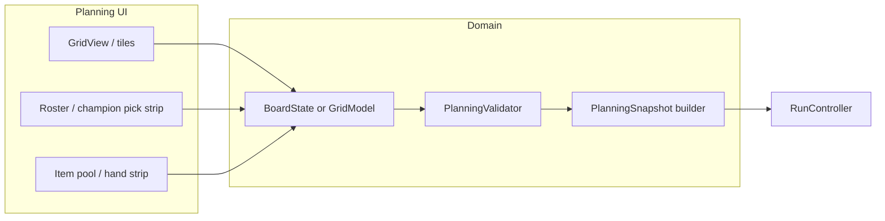

# Phase C — Detailed plan: planning grid, champions & items (local-first)

This document expands [§2 Phase C](../game-implementation-plan.md) in `game-implementation-plan.md`. It is intentionally **longer** than the Phase A/B detailed plans because Phase C is the first phase that combines **domain data**, **interaction-heavy UI**, **validation**, and **integration with the run shell** (`RunController`). It names concrete deliverables, splits work into **milestones**, and explicitly lists **what is still missing** before you should commit engineering time to implementation.

---

## Legend (reuse from Phase A)

| Signal    | Meaning                                                                                                                         |
| --------- | ------------------------------------------------------------------------------------------------------------------------------- |
| **BLOCK** | Do **not** start implementation of the dependent workstream until resolved or stubbed with an explicit ADR/default in this doc. |
| **STUB**  | Implement behind constants/`RunParams`/`PlanningParams`-style config so swapping decisions later does not rewrite core loops.   |
| **DEFER** | Explicitly out of scope for Phase C completion (may reserve extension points only).                                             |

---

## 1. Goal (parent doc)

Implement **local-first planning**: the player can **place champions on a grid**, **assign items from their deck** to champion slots (within stubbed rules), and **lock planning** so `RunController` receives a **complete, validated `PlanningSnapshot`** before **CombatResolve** (still stubbed until Phase D).

**In scope for Phase C**

- Grid **data model** + **occupancy invariants** aligned with `[PlanningSnapshot](../../Scripts/Domain/PlanningSnapshot.gd)`.
- **Planning UI**: visualize grid; place/move/remove **player** champions; attach/detach **items** (`CardInstance`) to `**ChampionInstance.equipped`** subject to slot/count rules.
- **Opponent placement for local testing**: developer ghost board stub (fixed layout resource or “mirror player” debug toggle)—**not** the ghost pipeline (Phase E).
- **Snapshot builder**: `PlanningSnapshot` populated with `player_champions`, `occupancy`, optional `deployed_allies` **if** allies are in scope for your MVP slice; `**run_id`**, `**round_index`** copied from `RunState`.
- **Validation layer**: illegal placements rejected with UI feedback; optional “why invalid” string for debug HUD.

**Explicitly DEFER for Phase C**

- **Economy**: earning/spending currency, shop offers, unlocking 2nd/3rd champion mid-run (Phase F + §4.1 locks).
- **Real combat resolution** (Phase D); Phase C only guarantees **correct snapshot shape** entering `CombatResolve`.
- **Serialization / disk save** of snapshots beyond optional debug export (Phase E+ unless you spike JSON lines earlier).
- **Network ghosts**, scouting UI rules, MMR (Phase E).

---

## 2. Preconditions — read before writing code

Implement Phase C **only after** the following are either **decided**, **stubbed with documented defaults**, or **explicitly postponed** with an engineering fallback.

### 2.1 System design (blocking or strongly shaping Phase C)

These items map to [§4.3–§4.6](../game-implementation-plan.md) in the parent plan and to open terminology in `[terminology.md](../Game%20Design/terminology.md)`.

| Topic                                                 | Why it matters for Phase C                                                                                                                                                                                   | Status in docs today                                            | Phase C stance                                                                                                                                         |
| ----------------------------------------------------- | ------------------------------------------------------------------------------------------------------------------------------------------------------------------------------------------------------------ | --------------------------------------------------------------- | ------------------------------------------------------------------------------------------------------------------------------------------------------ |
| **Grid topology**                                     | Drives coord math, adjacency, rendering, and occupancy keys (`GridCoord.to_key()`). Terminology calls for **hex**; `[GridCoord](../../Scripts/Domain/GridCoord.gd)` already supports **square + axial hex**. | **TBD** hex vs square for MVP                                   | **Resolved** pick one **primary** system for v1 UI + validation; keep the other behind `STUB` or compile-time flag only if cost is low.                |
| **Board dimensions**                                  | Determines iterable cells, camera bounds, and “player half vs opponent half”.                                                                                                                                | Not locked in repo                                              | **RESOLVED** Each player will have a 5 row by 3 column grid for square grid. Have similar dimension for Hex grid later                                 |
| **How many champions on board at run start**          | Placement slots and snapshot arrays.                                                                                                                                                                         | Terminology: 1 chosen + up to 2 more bought later (**economy**) | **STUB** Phase C: configurable **1–3 player champions** from existing roster/deck fields **without** shop; acquiring extras mid-run remains **DEFER**. |
| **Item slots per champion**                           | Size of `equipped` arrays and UI slot strip.                                                                                                                                                                 | §4.6 **TBD**                                                    | **STUB** uniform “`N` slots per champion” until champion-specific slot curves exist. let N be 3                                                        |
| **Slot semantics**                                    | Whether slot **index** maps to body location / weapon vs armor / aura rules.                                                                                                                                 | **TBD**                                                         | **STUB** index-only for MVP (slot `i` accepts any allowed `CardData` kind); document extension hook for tagged slots later.                            |
| **Color affinity / equipment bonuses**                | Drag validation + preview stats.                                                                                                                                                                             | §4.4 **TBD**                                                    | **STUB** “no bonus” or simple rule flag on `RunParams`/`PlanningParams` (+0) until palette locks.                                                      |
| **Planning resource (mana) for playing spells/cards** | Determines whether cards are freely assignable or gated during planning.                                                                                                                                     | Terminology: resource model **not finalized**                   | **STUB** optional: **infinite planning actions** for Phase C vertical slice                                                                            |
| **Allies (`deployed_allies`)**                        | Fills `PlanningSnapshot.deployed_allies` + grid occupancy for allies.                                                                                                                                        | Phase A lists allies as future combat scope                     | **STUB** either **zero allies** for first playable C slice **or** minimal ally placement using existing `CardInstance` + `CardData` pipeline.          |

**Deliverable:** carry forward chosen defaults into a short **Planning / grid ADR** (can live as §10 of this file or `Docs/Architecture/planning-grid-adr.md`—only add if the team wants a separate file).

---

### 2.2 Art, content & UX assets (usually missing early)

Phase C is UI-heavy. Implementation can proceed with **placeholders**, but production readiness needs an explicit **asset checklist**.

| Asset type                              | Purpose                                                          | Typical gap before polish                                                                                             |
| --------------------------------------- | ---------------------------------------------------------------- | --------------------------------------------------------------------------------------------------------------------- |
| **Grid tile graphics**                  | Cell backgrounds, hover, invalid highlight, player/opponent tint | **Missing** unless you reuse flat `ColorRect`/StyleBox prototypes                                                     |
| **Champion tokens / portraits on grid** | Drag targets, readability at cell size                           | May reuse existing champion art from `ChampionData` / collection if referenced                                        |
| **Item card frames**                    | Equipment strip & drag preview                                   | Reuse existing `[CardUI](../../Scripts/UI/Game/CardUI.gd)` / `[card_ui.tscn](../../Scenes/UI/card_ui.tscn`)` patterns |
| **Icons for phase + lock**              | Communicate “planning locked” vs editable (Use text for now)     | **Missing** in template                                                                                               |
| **Sound / VFX**                         | Optional drag-drop, lock, error buzz                             | **DEFER** for Phase C unless timeboxed                                                                                |

**Rule:** Do **not** block coding on final art; block only on **layout readability** decisions (cell size in px, safe margins) that affect control sizing.

---

### 2.3 Codebase: existing vs still missing (engineering inventory)

#### Already present (reuse; extend rather than fork)

| Artifact               | Location                                                                                                                       | Notes for Phase C                                                                                              |
| ---------------------- | ------------------------------------------------------------------------------------------------------------------------------ | -------------------------------------------------------------------------------------------------------------- |
| `GridCoord`            | `[Scripts/Domain/GridCoord.gd](../../Scripts/Domain/GridCoord.gd)`                                                             | Pick one coord system for UI math; hex rendering is harder than square—schedule accordingly.                   |
| `PlanningSnapshot`     | `[Scripts/Domain/PlanningSnapshot.gd](../../Scripts/Domain/PlanningSnapshot.gd)`                                               | Must become authoritative output of planning lock; **occupancy** today is contract-only (Phase A gap).         |
| `ChampionInstance`     | `[Scripts/Domain/ChampionInstance.gd](../../Scripts/Domain/ChampionInstance.gd)`                                               | Has `cell`, `equipped: Array[CardInstance]`; **no `level`** yet—acceptable **STUB** for C if combat unchanged. |
| `CardInstance`         | `[Scripts/Domain/CardInstance.gd](../../Scripts/Domain/CardInstance.gd)`                                                       | Wire from deck definitions when spawning item instances.                                                       |
| `ChampionData`, `Deck` | `[Scripts/Domain/ChampionData.gd](../../Scripts/Domain/ChampionData.gd)`, `[Scripts/Card/Deck.gd](../../Scripts/Card/Deck.gd)` | Source of definitions for roster + item pool.                                                                  |
| `InstanceIdScope`      | `[Scripts/Domain/InstanceIdScope.gd](../../Scripts/Domain/InstanceIdScope.gd)`                                                 | Allocate **all** new instances during planning for the run.                                                    |
| `RunController`        | `[Scripts/Run/RunController.gd](../../Scripts/Run/RunController.gd)`                                                           | Replace empty snapshot stub with **real builder** on `request_advance_from_planning()` once validation passes. |
| Run shell / HUD        | `[Scenes/Run/run_shell.tscn](../../Scenes/Run/run_shell.tscn)`                                                                 | Embed planning UI or load as child scene from run shell.                                                       |

#### Missing or incomplete before Phase C can be “done”

| Gap                               | Impact                                                           | Suggested Phase C action                                                                                                                                           |
| --------------------------------- | ---------------------------------------------------------------- | ------------------------------------------------------------------------------------------------------------------------------------------------------------------ |
| **Board layout definition**       | No resource describing legal cells, halves, deploy zones         | Add `**BoardLayout`** or `**GridSpec` Resource**: dimensions, coord system, iterable cells, `is_player_deployable(cell)`, optional **stub opponent** spawn points. |
| **Planning controller**           | No owner for interaction rules                                   | Add `**PlanningController`** `Node` (or module under `Run/`) orchestrating UI ↔ domain.                                                                            |
| **Snapshot validation**           | Illegal states could reach Phase D                               | `**PlanningValidator`** pure functions or ref class: returns `bool` + errors; call before lock.                                                                    |
| **Opponent stub data**            | Empty `opponent_champions` every round                           | `**OpponentPlanningStub` Resource** or editor tool: static champion defs + cells for local testing.                                                                |
| `**ChampionInstance.level`**      | Terminology implies leveling                                     | **DEFER** numeric leveling in C unless §4.5 locks; optional display-only field `level := 1`.                                                                       |
| **Deck → `CardInstance` factory** | Need deterministic item instances with ids                       | `**DeckInstanceBuilder`** or method on `PlanningController` creating `CardInstance` rows from deck definitions + scope.                                            |
| **Legacy `BoardUI` / TCG board**  | Wrong interaction model for run planning                         | **Do not extend** as primary path; either isolate or build `**PlanningBoardUI`** beside it (parent §3).                                                            |

---

## 3. Recommended architecture (high level)

**Single source of truth during planning:** a `**BoardState`** (name illustrative) owned by `PlanningController`, not scattered node state. UI reads/writes through controller methods so `occupancy` and instance ids stay consistent.

---

## 4. Milestones (suggested order)

Larger teams can parallelize **M1–M2** vs **M3** after `BoardState` API is sketched.

### Milestone C1 — Grid spec + board model (no fancy UI)

- Add `**GridSpec` / `BoardLayout`** Resource + iteration helpers.
- Implement `**BoardState`** (or equivalent) with operations: `place_champion`, `move_champion`, `remove_champion`, `assign_item`, `clear`.
- Unit-testable validation: out-of-bounds, collision, slot overflow, wrong player half.

### Milestone C2 — Snapshot + RunController integration

- `**build_planning_snapshot(board_state) -> PlanningSnapshot`** including `run_id` / `round_index` from `RunState`.
- Replace `[RunController._build_planning_snapshot_stub()](../../Scripts/Run/RunController.gd)` with real data when **validation passes**.
- If validation fails: stay in **Planning** phase; surface error (toast / label).

### Milestone C3 — Planning UI (square grid recommended first)

- `**PlanningBoardView`** scene: draws cells from `GridSpec`; input → controller.
- **Champion roster** UI: pick from `Deck.hero` + configured extras (stub list).
- **Item strip**: reuse card UI where possible; drag-drop or click-to-assign **STUB** interactions acceptable if documented.

### Milestone C4 — Opponent stub + polish pass

- `**OpponentPlanningStub`** fills `opponent_champions` + `occupancy` for AI cells.
- Visual differentiate opponent cells; optional “reset layout” debug button.

### Milestone C5 — Hex grid (optional branch)

- Only after square path is stable; includes pixel layout math and hit-testing for hexes.

---

## 5. New / touched scripts & scenes (expected)

Paths stay under `res://Scripts/` and `res://Scenes/` unless noted. Exact filenames are suggestions; keep `**class_name`** discoverable.

| Deliverable                                             | Role                                                                          |
| ------------------------------------------------------- | ----------------------------------------------------------------------------- |
| `**Planning/GridSpec.gd**` (or `Domain/BoardLayout.gd`) | `Resource`: dimensions, coord system, deploy rules.                           |
| `**Planning/BoardState.gd**`                            | `RefCounted`: champions, allies, occupancy sync.                              |
| `**Planning/PlanningController.gd**`                    | `Node`: bridges UI + `BoardState`; talks to `RunController` for lock request. |
| `**Planning/PlanningValidator.gd**`                     | Pure validation + human-readable errors.                                      |
| `**Planning/PlanningSnapshotBuilder.gd**`               | Converts `BoardState` → `PlanningSnapshot` (duplicate if combat will mutate). |
| `**Planning/OpponentPlanningStub.gd**`                  | `Resource` or small loader for test opponents.                                |
| `**UI/Planning/PlanningBoardView.gd**` + `**.tscn**`    | Grid rendering + input.                                                       |
| `**UI/Planning/ChampionRosterRow.gd**` + scene          | Pick / summon champions into deploy zone (per design stub).                   |
| `**UI/Planning/ItemAssignmentStrip.gd**` + scene        | Deck-derived assignable items.                                                |
| `**Scenes/Run/run_shell.tscn**` (update)                | Instance planning UI under shell; hide debug strip behind flag if needed.     |

**Touch points**

- `**RunController.request_advance_from_planning()`**: call validator → build snapshot → advance phase (same as Phase B flow).
- `**RunHud`**: optional sublabels (“Placement valid”, opponent summary).

---

## 6. Testing procedure (Phase C acceptance)

Manual + lightweight automated checks:

1. **Grid rules:** Cannot place two champions on one cell; cannot place on opponent-only cells (per `GridSpec`).
2. **Items:** Cannot exceed slot count; removing champion returns items to pool or graveyard per stub rule (document behavior).
3. **Snapshot integrity:** After lock, every champion `instance_id` unique; every `occupancy` key matches a champion or ally; `run_id` matches `RunState`.
4. **Run loop:** Full cycle **Planning → CombatResolve (stub) → RoundResult** unchanged from Phase B; no dependency on `GameState` for planning.
5. **Regression:** Main menu → Run → planning → lock → stub combat still advances rounds.

Optional: **GdScript unit tests** for `PlanningValidator` + snapshot builder with fixed `GridSpec`.

### C1 automated test scene

`Scenes/Tests/c1_tests.tscn` + `Scripts/Tests/C1BoardStateTests.gd` cover the four required C1 cases in code (no `.tres` fixtures needed). Run in two ways:

**In the editor:** open `Scenes/Tests/c1_tests.tscn` and press **F6**; read `TEST C1:` lines in the Output dock.

**Via Godot MCP (headless):**
1. Call `run_project` with `projectPath = "/Users/bryanjiang/Godot/tftcg"` and `scene = "res://Scenes/Tests/c1_tests.tscn"`.
2. Call `get_debug_output` immediately.
3. Inspect the `output` array for `TEST C1: <name> PASS` lines and `TEST SUMMARY: X/Y passed`.
4. Any `FAIL` line names the failing case; fix the referenced `BoardState` method and re-run.

---

## 7. Acceptance checklist (Phase C “done”)

- **Design stubs** for dimensions, slot count, and primary coord system are written down (this doc §2 or ADR).
- **BoardState + occupancy** stay consistent under all mutations exposed to UI.
- **Validated `PlanningSnapshot`** produced on planning lock with non-empty **player** placement for test scenarios.
- **Opponent stub** populates opponent side for local playtests (no ghost network).
- **Planning UI** usable without editor-only hacks (minimum: place/move champions, assign items).
- **No hard dependency** on Phase D combat math or Phase E ghosts.
- **Asset gaps** documented for art pass (§2.2) if still placeholder graphics.

---

## 8. Traceability

| Parent section                                                        | This doc                     |
| --------------------------------------------------------------------- | ---------------------------- |
| [game-implementation-plan §2 Phase C](../game-implementation-plan.md) | §1, §5–7                     |
| [game-implementation-plan §4.3–§4.6](../game-implementation-plan.md)  | §2.1                         |
| [Phase A detailed plan](phase-a-detailed-plan.md)                     | §2.3                         |
| [Phase B detailed plan](phase-b-detailed-plan.md)                     | §5 RunController integration |

Update this document when **hex MVP** is chosen, when **item slot rules** lock, or when **economy-driven champion unlock** replaces the Phase C roster stub.

---

## 9. Open risks (schedule)

| Risk                                                  | Mitigation                                                                                           |
| ----------------------------------------------------- | ---------------------------------------------------------------------------------------------------- |
| Hex UI **much** more expensive than square            | Ship square slice first (**Milestone C3**); branch hex (**C5**).                                     |
| Reusing legacy `**BoardUI`** confuses TCG vs run      | Keep planning UI **separate scene tree** under run shell.                                            |
| `**PlanningSnapshot` serialization** ballooning scope | In-memory only until explicit Phase E/D spike; optional debug JSON export.                           |
| Item pipeline still `**CardData`-heavy                | Document mapping `CardType` → equip eligibility in one module to avoid scattered `match` statements. |

---

## 10. Summary: “Do not implement yet” short list

If **any** of the following are undefined **and** you lack a stub default, pause **implementation** until clarified:

1. **Primary grid system for MVP UI** (square vs hex) + **board size**.
2. **Deployable region** per side (which cells).
3. **Number of item slots per champion** (integer).
4. **Whether allies ship** in the first C milestone or are explicitly deferred to a later milestone.

Everything else in §2 can default to **STUB** constants with TODOs tied to parent §4.