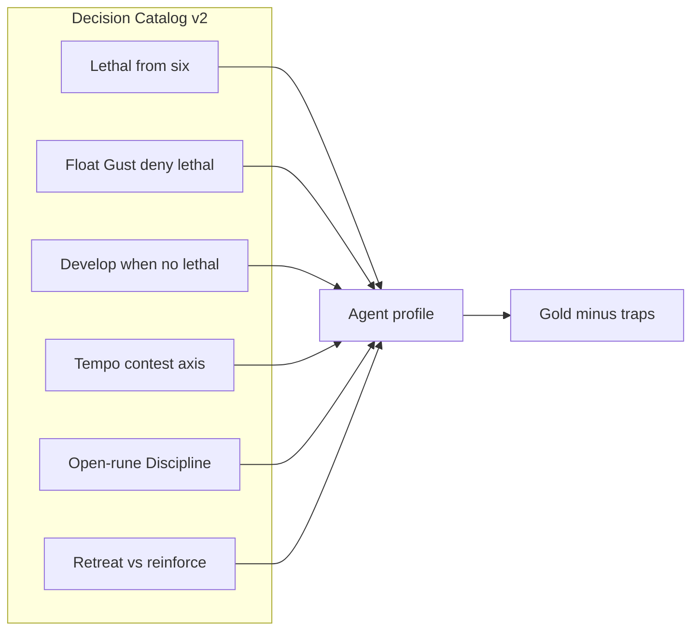

# AI Evaluation Decision Catalog v2

Curated **agent-lane** positions that measure contested decision quality:
attractive wrong lines (traps) vs correct strategic outcomes.

Easy freebies from the former decision-v1 set are tagged `agent_smoke` and
regress under [`agent-argmax-smoke.json`](../../Data/AI/Eval/manifests/agent-argmax-smoke.json)
with Godot argmax (no LLM). This catalog is the harder reasoning gate.

Source of truth for each case: `Data/AI/Eval/positions/<case_id>.json`.

Run:

```bash
export GODOT=/Applications/Godot.app/Contents/MacOS/Godot   # or your binary
python -m ai_agent.eval run --manifest Data/AI/Eval/manifests/decision-v2.json
```

Default profile is `baseline-argmax` (label / smoke). For live Reasoner, set
manifest `profiles` to `["reasoner-default"]` (needs API credentials; see
[AI_Evaluation_Operations.md](AI_Evaluation_Operations.md)).

Each run writes `metrics.json` beside `report.md` with hard/easy gold pass rates,
trap rate, validity/timeout rates, and cost aggregates.

## Engine lane vs agent lane

| Lane | Question it answers | Typical gold |
|---|---|---|
| `engine` | Can TurnSearch / commit / reject / seed safely? | hash rejected, line complete |
| `agent` | Did the agent pick a good action in this position? | wins game, refuses trap, floats mana |

## How grading works

1. **Hard invariants** — trial invalid if these fail.
2. **Trap outcomes** — if any trap matches, **gold fails** (attractive wrong line).
3. **Gold outcomes** — release-relevant decision quality (any-of after traps clear).
4. **Silver outcomes** — diagnostic only; never the sole release gate.
5. **Trajectory / cost** — tool hygiene and budgets; rationale text is never a gate.

## Taxonomy and v2 cases



| Case ID | Family | Split / label | Fixture | Gold | Trap |
|---|---|---|---|---|---|
| `close-from-six-double` | Lethal recognition | dev / gold | `eval_close_from_six_double.json` | `wins_game` | `command_equals` end turn |
| `float-gust-deny-lethal` | Save energy for reaction (float) | dev / gold | `eval_float_gust_deny_lethal.json` | `command_equals` end turn | `command_prefix` play chemtech-enforcer |
| `spend-develop-no-threat` | Save energy for reaction (spend) | dev / gold | `eval_spend_develop_no_threat.json` | `command_prefix` play stalwart-poro | `command_equals` end turn |
| `hold-open-rune-discipline` | Open-rune respect (hold) | dev / gold / **fidelity_limited** | `eval_hold_open_rune_discipline.json` | `line_contains` battlefield-b | `line_contains` battlefield-a / `command_equals` end turn |
| `take-closed-runes-contest` | Open-rune respect (take) | dev / gold | `eval_take_closed_runes_contest.json` | `line_contains` battlefield-a | `line_contains` battlefield-b / `command_equals` end turn |
| `retreat-low-score-threat` | Retreat vs reinforce (retreat) | dev / gold | `eval_retreat_low_score_threat.json` | `line_contains` to base | `line_contains` to battlefield-a |
| `reinforce-hold-at-seven` | Retreat vs reinforce (hold) | dev / gold | `eval_reinforce_hold_at_seven.json` | `line_contains` to battlefield-a | `line_contains` to base |
| `tempo-hold-contested-wipe` | Tempo contest (hold) | dev / gold | `eval_tempo_hold_contested_wipe.json` | `line_contains` play raging-soul / battlefield-b | `line_contains` battlefield-a |
| `tempo-take-contested-fof` | Tempo contest (take) | dev / gold | `eval_tempo_take_contested_fof.json` | `line_contains` battlefield-a | `command_equals` end turn / spend FoF |

All nine carry the tag `decision_v2`. Default manifests exclude `fidelity_limited`,
so the open-rune **hold** twin is catalogued but not gold-gated until opponent
reactions are simulated. Families: `tempo-contest`, `resource-react`,
`open-rune-react`, `retreat-reinforce`.

### Case briefs

#### `close-from-six-double` — Lethal recognition

- **Objective:** At score 6 with board to take both empty battlefields, win now.
- **Difficulty:** medium.

#### `float-gust-deny-lethal` — Save energy (float Gust)

- **Objective:** You control BF-A with Blazing Scorcher. Opponent is at score 6 with
  Thousand-Tailed Watcher + Stalwart Poro in base and can kill your unit then
  take the empty field for the win. End turn floating 1+ energy so Gust can
  bounce the poro.
- **Difficulty:** hard.
- **Note:** Baseline argmax may hit the trap (play Chemtech). Intentional
  discriminator. Contrast twin of `spend-develop-no-threat`.

#### `spend-develop-no-threat` — Save energy (spend / develop)

- **Objective:** Empty board; opponent has two small base units but score 0 —
  not a lethal clock. Play Stalwart Poro instead of passing to float Gust.
- **Difficulty:** hard.
- **Note:** Contrast twin of `float-gust-deny-lethal`. Same “have Gust + 2
  energy” shape; no lethal means develop is correct.

#### `hold-open-rune-discipline` — Open-rune respect (hold)

- **Objective:** Opponent holds BF-A with Stalwart Poro (2), two ready runes, and
  Discipline. BF-B is empty. Take B with Flame Chompers (3); do not contest A
  (Discipline → 4 > 3) and do not idle end turn.
- **Difficulty:** hard.
- **Fidelity:** `fidelity_limited` — gold assumes the opponent casts Discipline, but
  search/sim currently auto-passes opponent reactions, so contesting A looks winning
  under the engine world model. Excluded from default manifests
  (`include_fidelity_limited: false`). Diagnostic only until reactions are simulated.
- **Note:** Twin of `take-closed-runes-contest` (that twin stays authoritative).

#### `take-closed-runes-contest` — Open-rune respect (take)

- **Objective:** Same board (poro on A, empty B), but opponent runes are exhausted
  so Discipline cannot be paid. Contest A (3 > 2) rather than only taking empty B
  or passing.
- **Difficulty:** hard.
- **Note:** Contrast twin of `hold-open-rune-discipline`. Greedy search often
  prefers empty B — intentional trap on the take twin.

#### `retreat-low-score-threat` — Retreat vs reinforce (retreat)

- **Objective:** Low scores; Chemtech (2) on A faces Raging Soul (4) in opp base.
  Hand has Flame Chompers (3). Recall off A and develop at base — do not reinforce A.
- **Difficulty:** hard.
- **Note:** Twin of `reinforce-hold-at-seven`.

#### `reinforce-hold-at-seven` — Retreat vs reinforce (hold)

- **Objective:** Same threat shape, but both players are at 7 and you have two
  Flame Chompers plus energy to play both. Reinforce A to hold; do not retreat.
- **Difficulty:** hard.
- **Note:** Contrast twin of `retreat-low-score-threat`.

#### `tempo-hold-contested-wipe` — Tempo contest (hold / wipe)

- **Objective:** Opponent holds BF-A (3 might) with a 7-might unit ready in base.
  Do not dump a 2-might attacker + Discipline (+2) + 4-might reinforce into A;
  that pile dies next turn. Develop Raging Soul at base and/or take empty BF-B
  while keeping base presence.
- **Difficulty:** hard.
- **Note:** Baseline argmax currently hits the trap (includes a move onto
  battlefield-a). Intentional discriminator for reasoner judgment vs greedy contest.

#### `tempo-take-contested-fof` — Tempo contest (take / FoF protect)

- **Objective:** Same contested A + watcher setup as the hold twin, but Fight or
  Flight is in hand with an open rune left for next turn. Contest A; keep FoF
  unspent so you can bounce/recall if the watcher comes in.
- **Difficulty:** hard.
- **Note:** Contrast twin of `tempo-hold-contested-wipe`. FoF flips A from trap
  to gold.

## Backlog (not in v2 gold yet)

| Family | Why deferred |
|---|---|
| Open-rune hold (`hold-open-rune-discipline`) | Already authored but `fidelity_limited` until opponent reactions are simulated |
| Contested must-block / hold-through-opponent | Needs better opponent modeling; keep `fidelity_limited` |
| Deny opponent odd-score progression | Contested; diagnostic until sim fidelity improves |
| Power-recycle discipline | Needs clearer pool/recycle observables in adapters |
| Sealed holdout twins of v2 gold | Promote after labels stabilize |

## Authoring cookbook — add a contested case

1. **Pick a decision family** with ≥2 legal lines and a clear attractive wrong line.
2. **Build a minimal fixture** under `Scripts/Tests/Tcg/fixtures/`.
3. **Prove offline** with search before labeling:

   ```bash
   ./Scripts/run_eval_position.sh \
     --fixture res://Scripts/Tests/Tcg/fixtures/<name>.json \
     --mode search
   ```

4. **Write** `Data/AI/Eval/positions/<case-id>.json`:
   - `eval_lane: "agent"`, tags include `decision_v2`
   - `trap_outcomes` for the wrong line; `acceptable_outcomes` for gold
   - Prefer outcome kinds: `wins_game`, `score_after_at_least`, `score_after_equals`,
     `command_prefix`, `command_equals`, `command_contains`, `line_contains`, `discard_card`
5. **Add** the filename to `case_globs` in
   `Data/AI/Eval/manifests/decision-v2.json`.
6. **Validate:**

   ```bash
   python -m ai_agent.eval validate-corpus
   python -m ai_agent.eval render-catalog
   python -m ai_agent.eval run --manifest Data/AI/Eval/manifests/decision-v2.json
   ```

7. **Promote carefully:** gold only when human/argmax adjudication agree on traps
   and acceptable sets. Contested fidelity-limited stays diagnostic.

### Template skeleton

```json
{
  "schema_version": "1.0",
  "case_id": "my-decision-case",
  "title": "Short title",
  "summary": "One-line position summary.",
  "objective": "What a strong agent should try to achieve.",
  "desired_result": "Observable outcome after the decision.",
  "fixture_path": "res://Scripts/Tests/Tcg/fixtures/my_fixture.json",
  "fixture_hash": "",
  "acting_seat": 0,
  "decision_type": "main_phase",
  "tags": ["decision_v2", "trap"],
  "split": "dev",
  "eval_lane": "agent",
  "origin": "hand_built",
  "fidelity_status": "authoritative",
  "label_tier": "gold",
  "difficulty": "hard",
  "hard_invariants": [
    {"kind": "chosen_line_complete", "params": {}, "description": "Complete line"}
  ],
  "acceptable_outcomes": [
    {
      "kind": "score_after_at_least",
      "params": {"my_score_after": 6},
      "description": "Correct continuation",
      "label_tier": "gold"
    }
  ],
  "trap_outcomes": [
    {
      "kind": "score_after_equals",
      "params": {"my_score_after": 5},
      "description": "Attractive wrong stop",
      "label_tier": "gold"
    }
  ],
  "exclusions": "Never take the vanity line.",
  "setup_notes": "Minimal board description.",
  "provenance": {
    "source_fixture": "my_fixture.json",
    "notes": "Adjudicated against search + human review",
    "created_by": "your-name"
  }
}
```

Leave `fixture_hash` empty on first write; `validate-corpus` / `load_case` fill it.
Commit the filled hash once stable.
