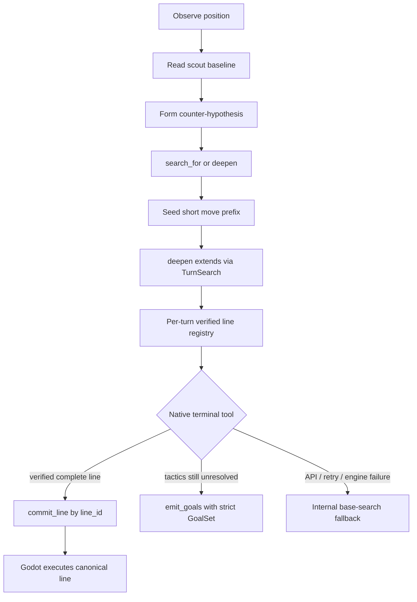

# Reasoner Investigation and Commitment Improvements (FINISHED)

Status: **Phases A0–C implemented for deterministic coverage (2026-07-25);
live behavioral acceptance pending.** Companion to
`Deliberative_Reasoning_Toolkit.md` (§5–§7 Phase 3), which remains the
architectural source of truth for the live-tool Reasoner. The implementation
now has native terminals, strict goals, request-scoped registries, complete
hashed line commitment, root identity, and an enforced investigation gate.
The §5.3 sample of 20 eligible turns across three games has not yet been run.

Implemented verification baseline:

- Python: full `ai_agent/tests` suite, including terminals, registry chaining,
request isolation, root-aware caching, gates, and canonical `/reason` payloads.
- Godot: full TCG suite, including seeded completeness, budget-frontier
rejection, Jinx auto-choice hashing, canonical non-scout replay, root/hash
rejection, and the Turn-8 two-point continuation regression.
- EngineServer: headless smoke covers health, simulate, search, and seeded search.

---

## 1. Goal

Fix four interlocking failures observed in Reasoner playtests:

1. **Scout anchoring** — almost always rubber-stamps the scout ranking.
2. **Shallow investigation** — one-ply `simulate_move`, never `search_for` /
  `deepen`, despite unused engine budget.
3. **No-op GoalSets** — emits `kind="goals"` with `goals: []`, so overlays do
  nothing.
4. **Cannot commit non-scout lines** — no registry of engine-verified lines
  outside the initial scout list; AI-authored exact move scripts are the wrong
   fix (see §3 decision 6).

Outcome: the Reasoner investigates alternatives with search-driving tools,
creates novel plans only via seeded engine search, and commits complete hashed
lines by reference — or emits a non-empty GoalSet when tactics remain open.

---

## 2. Evidence (bounded playtest sample)

Source: `ai_agent/agent_search.log` Reasoner turns 2, 4, 6, 8.

| Observation                  | Detail                                                                                                                                                                                          |
| ---------------------------- | ----------------------------------------------------------------------------------------------------------------------------------------------------------------------------------------------- |
| No line commits              | All four turns emitted `kind="goals"`; none committed a line.                                                                                                                                   |
| Empty GoalSets               | All four validated GoalSets had `goals: []` → no-op overlays, even when the think phase listed concrete goals.                                                                                  |
| Tool mix                     | Five one-ply `simulate_move`, one failed `simulate_line`, and **zero** `search_for` / `deepen`. One logged call still had 97% budget remaining; budget use on the other turns was not recorded. |
| Prompt-choice impedance (T2) | Attempted Jinx line went illegal around auto-resolved discard choices; fell back to verifying only the first move.                                                                              |
| Formatter override (T4, T6)  | Prose recommended committing a first move; formatter converted both to goals because the line was “contested.”                                                                                  |
| Missed continuation (T8)     | Verified one conquest move; later full search found a stronger multi-action two-point line.                                                                                                     |
| Stale-context risk           | Reasoner cache identity is game + turn + opponent-action count, not the exact root state; a same-turn replan can reuse an old result.                                                           |

### Symptom → cause

| Symptom                      | Cause                                                                                                                                                                      |
| ---------------------------- | -------------------------------------------------------------------------------------------------------------------------------------------------------------------------- |
| Smallest useful one-ply sims | `prompts/reasoner_output_discipline_think.md` rewards “smallest useful” investigation; no controller-enforced alternative search.                                          |
| Contested → empty goals      | `prompts/reasoner_format_phase.md` prefers goals for contested lines and its only GoalSet example contains `goals: []`.                                                    |
| Wasted first round           | `reasoner.py` preloads scout evidence then forces `search_turn` in round 0 — no new branch.                                                                                |
| Silent goal degradation      | The reused goal parser drops invalid goals individually; the Reasoner accepts the surviving empty list instead of retrying with the raw validation errors.                 |
| False verification surface   | `reasoner.py` adds successful one-ply `simulate_move` arguments to `verified_sequences`, even though simulation is evidence, not a complete replay source.                 |
| AI scripts break on choices  | `MoveSimulator.gd` auto-resolves AI prompts in quiescence but does not return those steps/hashes from `simulate_line` — **exact AI move lists are the wrong commit path.** |
| Hashes dropped in Python     | `schemas.py` omits `expected_pre_hashes` from `CandidateLine`; corpus rebuilds in `agent.py` / `skills.py` omit hashes and `move_contexts`.                                |
| Cannot deepen live results   | Live `search_for` / `deepen` results stay loop-local; not merged back for later tool calls.                                                                                |
| ID collisions                | Every engine search returns local IDs such as `line-1`; multiple live searches need request-scoped canonical IDs before results can be chained.                            |
| Non-scout commits fail       | `AIPlayer.gd` resolves `chosen_line_id` only against scout lines.                                                                                                          |
| Unsafe direct replay         | `AIPlayer.gd` accepts a hashless `reasoner-direct` move list when no scout ID is supplied.                                                                                 |
| Incomplete-line ambiguity    | `TurnSearch` promotes frontier nodes to candidate leaves when a budget stops search, but candidate lines do not explicitly say whether they complete the turn.             |
| Shared-state risk            | Brief state, history, scout lines, and search corpus are process-global in `skills.py`; a registry-only `ContextVar` would not isolate the whole request.                  |
| Stale Reasoner cache         | Cache invalidation does not include the engine root-state hash.                                                                                                            |
| Seed search unused           | `deepen(moves=...)` already implements “short prefix → engine extends,” but prompts frame it only as refining an existing line.                                            |

---

## 3. Target architecture

### Locked decisions

1. **Structured termination, not a second decision.** Primary termination is
  two native terminal tools: `commit_line(line_id, rationale)` and
   `emit_goals(goal_set, rationale)`. The Reasoner may still think in natural
   language; the decision crosses the execution boundary as typed arguments.
   Prose-to-JSON formatting remains a fail-safe only and may not reinterpret a
   valid terminal decision.
2. **Three orchestration outcomes.** The model sees the two tools above.
  Separately, the controller has an internal `base_search_fallback` for API
   failure, exhausted terminal retries, or unavailable engine state. Empty goals
   are invalid model output; they are not overloaded to represent fail-safe.
3. **One request-scoped context.** A `ContextVar`-backed Reasoner turn context
  owns the brief state, history handle, scout corpus, live corpus, root-state
   hash, tool budget reference, and verified-line registry. Do not isolate only
   the registry while leaving `skills.py` state process-global.
4. **Verified-line registry.** The per-request registry is populated by scout,
  `search_for`, and `deepen` (including seeded prefixes). Each entry stores:
   canonical ID, original engine ID, source lineage, canonical moves,
   `move_contexts`, `expected_pre_hashes`, resolved/search state, opponent
   windows, root-state hash, legality, completeness, and terminal reason.
5. **Engine-owned completeness.** A line is committable only when the engine
  marks it complete for its search mode (main-turn end/game over; reactive
   window resolved). Budget-cutoff frontier candidates may be investigated but
   never committed. `TurnSearch` / EngineServer responses must expose this
   contract; the engine is sufficient for seeded expansion, not yet for explicit
   completeness metadata.
6. **No AI-authored exact lines.** Do **not** add `simulate_candidate`. Do
  **not** commit AI-provided full move scripts. Novel plans: AI supplies a
   **short strategic prefix** (1–3 moves); `deepen(moves=...)` / seeded
   `/engine/search` extends via `TurnSearch._apply_seed_moves` into scored
   complete lines with hashes and intermediate choices. Keep `simulate_move` /
   `simulate_line` for evidence and sanity-checking only; remove the current
   `simulate_move` → `verified_sequences` shortcut. Defer a cosmetic
   `search_from` alias until behavior validates.
7. **Commit by reference.** Terminal output selects a registry `line_id` only;
  it never recopies commands. `/reason` returns the selected canonical line
   payload so Godot executes scout and non-scout lines through the same
   hash-based divergence checks. Remove hashless `reasoner-direct`.
8. **Root identity is mandatory.** Godot sends the pinned engine root-state hash
  with `/reason`; every registry entry and committed response carries it.
   Reasoner cache identity includes this hash. Godot checks it before the first
   step, then checks each `expected_pre_hash`.
9. **Contested is not disqualifying.** Opponent windows remain uncertainty
  labels; they do not force GoalSet fallback. Commit the complete engine-truth
   unanswered line; divergence detection abandons/replans if the opponent
   interacts.
10. **Investigation gate measures useful work.** On an eligible turn, the
  controller requires at least one **successful** `search_for` or `deepen`
    attempt. If it returns a sequence distinct from the scout leader, the model
    must compare them before termination. A failed/empty ritual call does not
    satisfy the gate. Exempt forced/single-playable-line, engine-unavailable,
    and budget-exhausted cases; log the exemption.
11. **Dynamic line chaining with canonical IDs.** Register live search results
  before returning them to the model, rewrite outgoing IDs to request-unique
    source-prefixed IDs with a sequence-hash suffix, and retain the original
    engine ID as metadata. Sequence duplicates resolve to one canonical entry
    with source lineage, so later `deepen(line_id)` / `commit_line(line_id)`
    cannot collide on repeated engine IDs such as `line-1`.
12. **Goal correctness is all-or-nothing.** Native `emit_goals` uses the real
  GoalSet JSON schema. It accepts 1–4 valid goals, overrides `turn` from the
    current brief state, rejects the whole terminal call if any requested goal
    is invalid, and returns raw validation errors for a bounded retry. Never
    silently drop goals into a valid-looking empty set.
13. **Anchoring control is structured.** Prompt for a counter-hypothesis and
  evidence that would overturn the scout ranking, but enforce behavior through
    the successful investigation gate and record the alternative objective/tool
    query in telemetry. Do not rely on unverifiable prose alone. Do not hide
    scout data or randomize ranks in the first corrective iteration.
14. **No redundant scout call.** Inline rendered scout steps, intermediate
  `move_contexts`, score drivers, and contested flags in the initial Reasoner
    message. When scout evidence is present, do not force `search_turn` in round
    0; reserve forced grounding for the no-scout path.

---

## 4. Phased action plan

### Phase A0 — Output correctness and baseline observability (implemented)

**In plain terms:** Make failures visible and stop accepting empty strategies
before changing commitment or search behavior.

| Action                                                                                           | Why                                                                                                                                                                                                            |
| ------------------------------------------------------------------------------------------------ | -------------------------------------------------------------------------------------------------------------------------------------------------------------------------------------------------------------- |
| Replace the empty GoalSet format example with a populated 1–4 goal example                       | The current example directly anchors the observed no-op output.                                                                                                                                                |
| Strict all-or-nothing goal validation, current-turn normalization, bounded retry with raw errors | Prevent silent goal dropping and turn `0`. Validation happens in `reasoner.py`; `tool_log_fmt.py` only renders it.                                                                                             |
| Separate internal `base_search_fallback` from model-authored `emit_goals`                        | Preserve safe degradation without treating empty goals as valid output.                                                                                                                                        |
| Remove contested-line → goals fallback from prompts                                              | Contested labels blocked otherwise engine-true commitments.                                                                                                                                                    |
| Remove `simulate_move` / `simulate_line` from commit verification                                | Simulation remains evidence; only registered search lines are executable plans.                                                                                                                                |
| Baseline telemetry                                                                               | Record terminal/fallback kind, valid-goal count, raw validation error, scout agreement, successful tool mix, unique sequence count, max complete line length, budget, latency, and downgrade/exemption reason. |
| Capture deterministic T2/Jinx and T8 root-state fixtures                                         | Turn the bounded playtest evidence into reproducible regressions before behavior changes.                                                                                                                      |

**Exit:** Empty model goals cannot validate; raw failures and the original
failure-mode metrics are reproducible.

### Phase A1 — Safe terminal and verified-line vertical slice (implemented)

**In plain terms:** Build one safe path from an engine-found plan to the live
game. Native `commit_line` is not considered complete until the registry,
canonical response, and Godot replay path exist together.

| Action                                                                                       | Why                                                                                                                                   |
| -------------------------------------------------------------------------------------------- | ------------------------------------------------------------------------------------------------------------------------------------- |
| Add request-scoped `ReasonerTurnContext` via `ContextVar`                                    | Isolate brief state, history, corpora, root hash, budget, and registry across requests.                                               |
| Add line contract fields: hashes, contexts, root hash, `complete`, terminal reason           | Python currently loses executable metadata; engine candidates do not explicitly distinguish complete lines from budget-cutoff leaves. |
| Add registry with sequence dedupe, collision-safe canonical IDs, and source lineage          | Non-scout results need stable references across live calls.                                                                           |
| Register scout and every live `search_for` / `deepen` result; return canonical IDs           | Enables exact `search_for` → `deepen` → `commit_line` chaining.                                                                       |
| Add native `commit_line` / `emit_goals` terminals and bounded terminal retry                 | The think phase keeps its reasoning role; the action crosses as typed data rather than being re-decided by a formatter.               |
| Return canonical `committed_line` from `/reason`                                             | Godot must receive the full registered payload instead of resolving only scout IDs.                                                   |
| Execute canonical lines in `AIPlayer`; check root hash before step 0 and pre-hash thereafter | Scout and non-scout plans get identical divergence safety.                                                                            |
| Remove `reasoner-direct` and key Reasoner cache by root hash                                 | Eliminate hashless replay and stale same-turn cached decisions.                                                                       |

**Exit:** Scout and seeded non-scout fixtures can commit only complete,
root-matched, engine-built lines by registry reference.

### Phase B — Search-driving behavior (implemented; live rate pending)

**In plain terms:** Spend the Reasoner’s investigation budget on a real
alternative instead of rereading the initial search.

| Action                                                                                 | Why                                                                     |
| -------------------------------------------------------------------------------------- | ----------------------------------------------------------------------- |
| Inline rendered scout steps, intermediate contexts, score drivers, and contested flags | Frees round 0 and avoids reconstructing engine-resolved choices.        |
| Drop forced duplicate `search_turn` when scout is installed                            | The current first round adds no new evidence.                           |
| Reframe existing `deepen(moves=...)` as “build a line from this strategic prefix”      | Seed-search capability already exists; defer a new `search_from` alias. |
| Prompt for a counter-hypothesis and overturn evidence                                  | Gives investigation a concrete purpose without hiding scout data.       |
| Enforce the successful investigation gate in the controller                            | Prompt compliance alone did not produce `search_for` / `deepen` use.    |
| Preserve node/time budget, explicit exemptions, and internal fallback                  | Investigation must not blow the turn clock or block forced decisions.   |

**Exit:** Eligible turns perform a successful search-driving attempt, compare
distinct alternatives when found, and can commit the resulting canonical line.

### Phase C — Deterministic verification implemented; §5.3 pending

**In plain terms:** Prove the corrected contracts and behavior on deterministic
scenarios and a fresh multi-game sample.

| Action                                     | Why                                                                                    |
| ------------------------------------------ | -------------------------------------------------------------------------------------- |
| Python unit tests (see §5.1)               | Lock request isolation, terminals, registry, IDs, hashes, cache, goals, and gates.     |
| Godot tests (see §5.2)                     | Lock completeness, seed-search hashing, root checks, and non-scout execution.          |
| T2/Jinx and T8 scenario regressions        | Prove auto-choice lines are executable and the two-point continuation is discoverable. |
| Fresh playtest telemetry acceptance (§5.3) | Validate behavior against the original failure modes with denominators.                |
| Existing suites + EngineServer smoke       | Prevent regressions in the proven engine/search floor.                                 |

**Exit:** §5.1–§5.3 pass. Only then is Phase 3 behaviorally validated.

### Phase D — Strength gate

**In plain terms:** After correctness and behavior are proven, measure whether
the Reasoner actually plays better.

Run the Phase-4 SPRT from `Deliberative_Reasoning_Toolkit.md` only after Phase C.
Tool-use frequency is not evidence of playing strength by itself.

---

## 5. Tests and acceptance criteria

### 5.1 Python unit tests

- Terminal-tool parsing (`commit_line` / `emit_goals`)
- All-or-nothing goal validation, empty-goal retry, and raw error logging
- Current-turn normalization
- Explicit `base_search_fallback`
- No redundant scout call when scout is preloaded
- Registry deduplication / ID namespacing
- Repeated engine IDs (`line-1`) across calls cannot collide
- `search_for` → `deepen` chaining via registry
- Seeded-prefix deepen registration
- Hash / `move_contexts` preservation through corpus rebuild
- Incomplete/budget-cutoff line rejection
- `simulate_move` and `simulate_line` never become commit sources
- Request-context isolation across concurrent requests
- Root-hash cache invalidation on same-turn state change
- Canonical `/reason` payload shape
- Investigation-gate exemptions (forced / single-line / budget exhausted)
- Failed/empty search-driving calls do not satisfy the investigation gate

### 5.2 Godot tests

- Seeded-prefix deepen → complete hashed lines with intermediate choices
- Jinx discard reproduction via seed search (not AI-scripted simulate)
- Direct canonical execution from non-scout registry ids
- Explicit incomplete marker for budget-cutoff candidate lines
- Root-state mismatch rejection before the first command
- Rejection of hashless invented lines
- Divergence after opponent interaction

### 5.3 Playtest telemetry acceptance

Run at least **20 eligible Reasoner turns across at least 3 games** and report
the eligible-turn denominator plus every exemption:

- **100%** of accepted `emit_goals` actions contain 1–4 valid goals and the
current turn.
- **Zero** silent goal drops, formatter overrides, or unclassified fallbacks.
- At least **90%** of eligible turns make a successful `search_for` or `deepen`
attempt. Empty/error calls do not count.
- Report how often a distinct non-scout sequence was found, compared, and
selected; do not require one to exist in every position.
- **100%** of line commits reference complete, root-matched registry entries
with parallel moves, contexts, and pre-hashes.
- **Zero** commits of AI-authored raw move lists or `simulate_`* arguments.
- Record scout agreement, registry source lineage, unique investigated
sequences, maximum complete line length, engine/model/total latency, and
budget consumption.
- Set and record median/p95 total-latency limits below the configured Godot
decision timeout before the run; fail acceptance if the limit is exceeded.

Seeded and scout commit-source coverage is guaranteed by deterministic scenario
tests; a natural playtest sample is not required to happen to contain both.

### 5.4 Regression gate

1. Existing Python test suite
2. `./Scripts/run_tcg_tests.sh`
3. EngineServer smoke
4. T2/Jinx + T8 scenario regressions
5. Phase-4 SPRT (`Deliberative_Reasoning_Toolkit.md` §7) **only after** §5.3
  passes

---

## 6. Out of scope

- Opponent modeling (`simulate_opponent` / `branch` / `rollout`) — still deferred
per the toolkit.
- Hiding or randomizing scout rankings as an anchoring fix (first iteration).
- Adding a `search_from` alias before the existing `deepen(moves=...)` framing
has been behaviorally evaluated.
- New Godot HTTP routes for seed search (existing `seed_moves` on
`/engine/search` is sufficient).
- Porting rules logic to Python.

---

## 7. Key file touch list (implementation reference)

| Area                       | Files                                                           |
| -------------------------- | --------------------------------------------------------------- |
| Terminal tools / loop      | `ai_agent/reasoner.py`, `ai_agent/agent.py`                     |
| Request context / registry | `ai_agent/reasoner_context.py` (new), `ai_agent/tool_budget.py` |
| Schemas / corpus           | `ai_agent/schemas.py`, `ai_agent/skills.py`                     |
| API / Godot                | `ai_agent/main.py`, `Scripts/AI/AIPlayer.gd`                    |
| Prompts                    | `ai_agent/prompts/reasoner_*.md`                                |
| Logging / telemetry        | `ai_agent/tool_log_fmt.py`                                      |
| Engine line contract       | `Scripts/Game/TurnSearch.gd`, `Scripts/AI/EngineServer.gd`      |
| Scenario tests             | `ai_agent/tests/`, `Scripts/Tests/Tcg/suites/`                  |

---

## 8. Relationship to the toolkit

`Deliberative_Reasoning_Toolkit.md` Phase 3 delivered the Reasoner stage
(ReAct loop, tool budget, emit line or GoalSet). This document is the
**behavioral corrective plan**: the wiring works; the observed playtest
behavior does not yet meet the design intent of a search-driving strategist.
This document resolves the toolkit §8 emit-contract question: contested is not
disqualifying when the unanswered line is complete and hash-protected. Update
that section when implementation lands so the two documents do not drift.
Phase 4 (SPRT) should wait until Phases A0–C here pass acceptance; Phase D is
the SPRT gate itself.